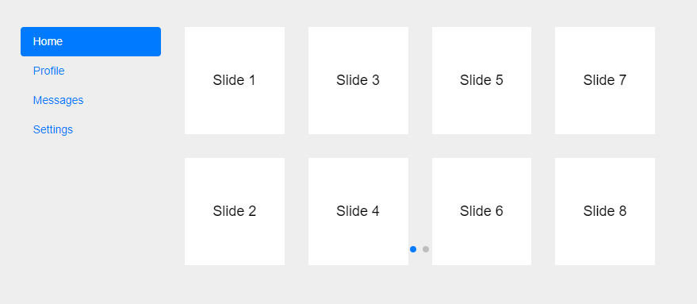

# Tabs carrousel with swiper

Add multiple instances of swiper in bootstrap tab

## Dependencies

* Bootstrap
* Swiper

## How to use

* Make a clone of this repository
* Access index.html or run it with live-server
